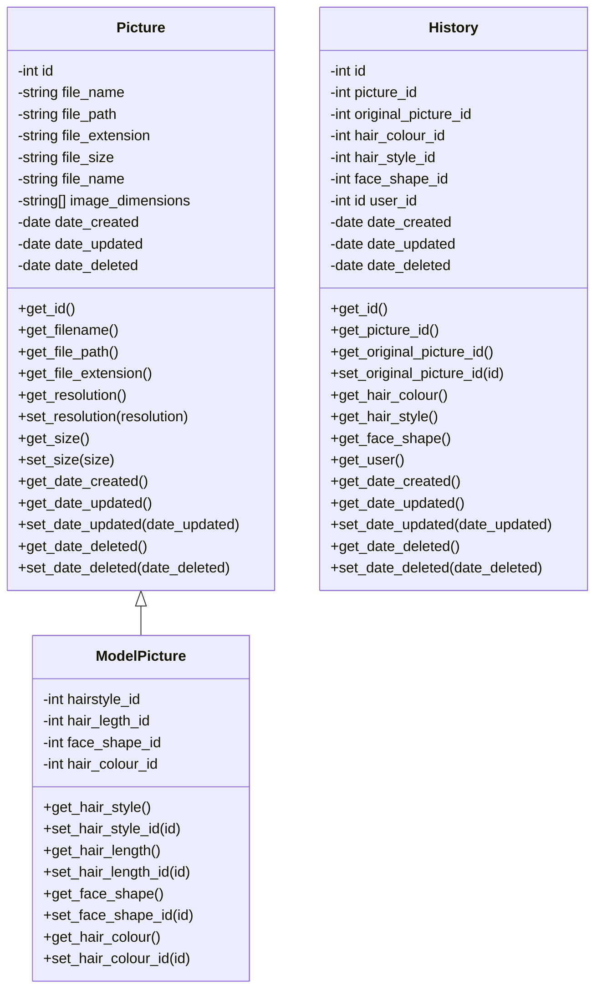
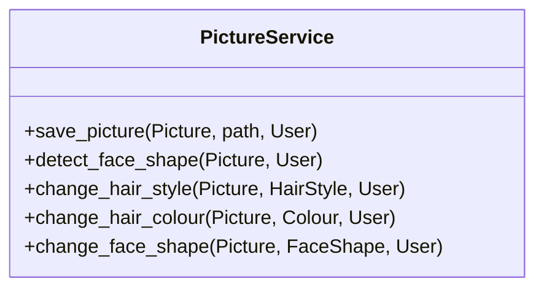
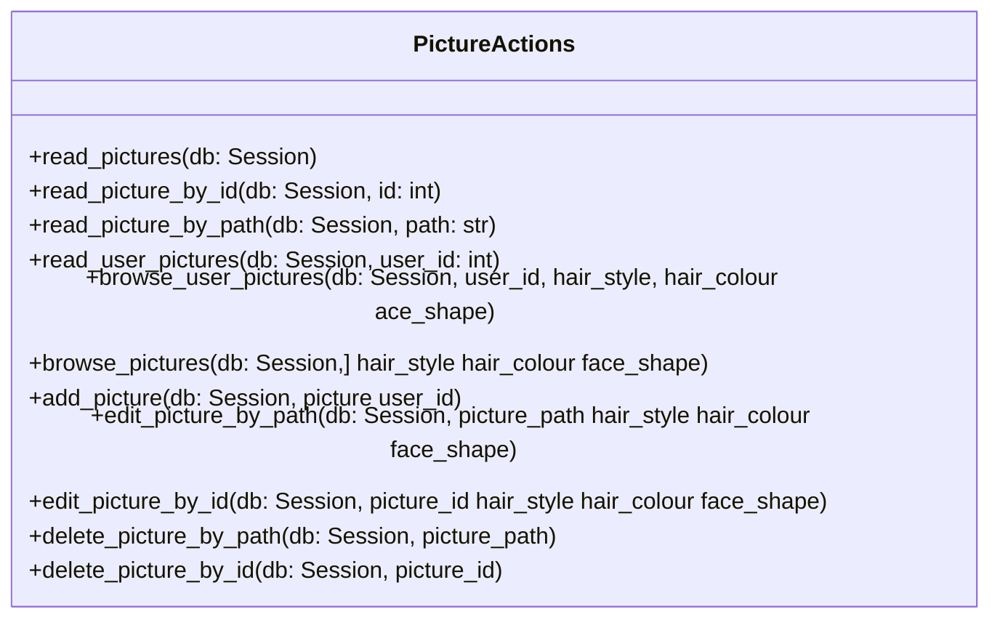

# StyleMe - Pictures-API - Design
REST API boilerplate for the hairdressing project

## Design

### Classes







### Models

`models/pictures.py`
```python
from sqlalchemy import Column, Integer, String
from app.database.db import Base

class Picture(Base):
    __tablename__ = "pictures"
    id = Column(Integer, primary_key=True, index=True)
    file_name = Column(String(255), unique=True)
    file_path = Column(String(255))
    file_size = Column(Integer)
    height = Column(String(255))
    width = Column(String(255))
```
